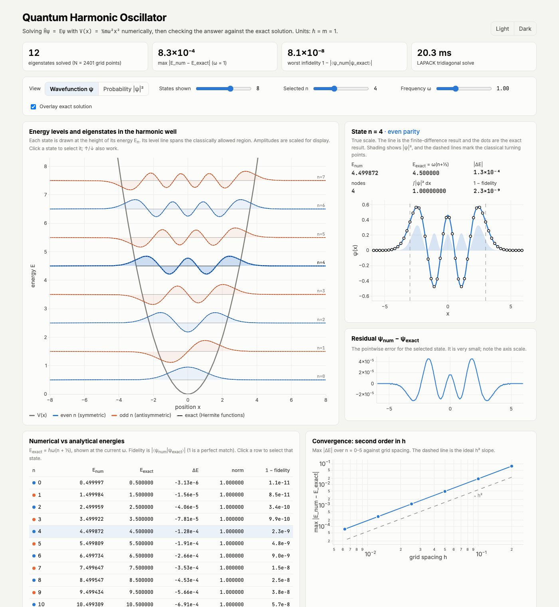
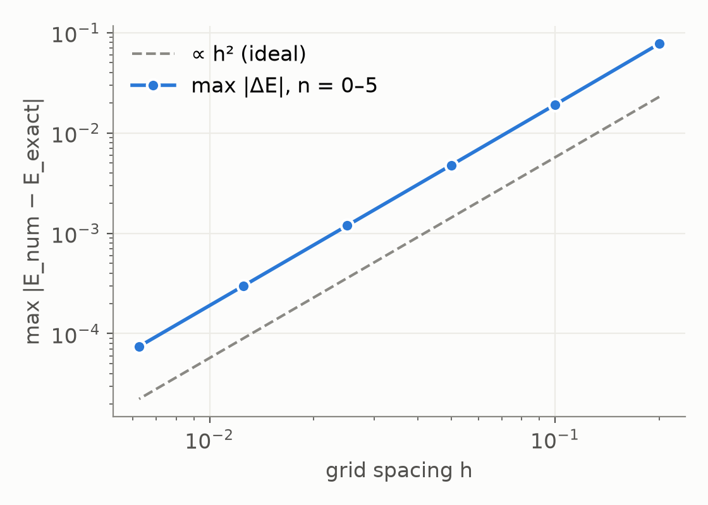

# Quantum Harmonic Oscillator: solved numerically, checked exactly

A finite-difference solver for the 1D time-independent Schrödinger equation with
V(x) = ½mω²x². Every result is checked against the exact textbook solution
E_n = ℏω(n + ½) with Hermite-function eigenstates, and the results are shown in
an interactive single-page demo.



| Result (12 states, N = 2401, h = 0.01) | Value |
|---|---|
| max \|E_num − E_exact\| | 8.3 × 10⁻⁴ |
| worst 1 − \|⟨ψ_num\|ψ_exact⟩\| | ≈ 8 × 10⁻⁸ |
| normalisation error | < 10⁻¹⁵ |
| error drop per halving of h | × 4.0 (second order) |



*Convergence study: max |E_num − E_exact| for n = 0–5 against grid spacing h, plotted by `scripts/make_slides.py` from a real solve on the same grids as `qho.build.convergence()` (not synthetic data).*

## System architecture



*Purple: model call · blue: deterministic code · green: human · amber: evaluation · grey: storage · dashed: external, optional, mocked or planned*

`python -m qho.build` calls `qho.solver.solve()` for the 12 lowest states on a
2401-point grid, compares them with the closed-form results from `qho.analytic`,
runs the convergence study and embeds everything as JSON in `demo/template.html`
to write `demo/index.html`. The page is opened straight from disk, and its
JavaScript draws the charts and table from the embedded data and rescales the
ω = 1 solution for the ω slider, so the browser never re-solves. Plotly.js and
fonts come from a CDN; without it the numbers still render ([fallback.md](fallback.md)).
`tests/` and `scripts/check_demo.py` check the physics and that the page matches
a fresh solve; the numerical steps are in [How it works](#how-it-works).

## Does it use AI at runtime?

No. There is no model, LLM or learned component: the energies and wavefunctions
come from a LAPACK tridiagonal eigensolver (`scipy.linalg.eigh_tridiagonal`) and
closed-form Hermite functions, and the browser only rescales and plots those numbers.

## Quick start

Requires Python ≥ 3.10. Units are ℏ = m = 1 (and ω = 1 in the solver).

```bash
python3 -m venv .venv
.venv/bin/pip install -r requirements.txt          # numpy, scipy, pytest

.venv/bin/python -m pytest -q                      # 18 physics + build tests
.venv/bin/python -m qho.build                      # writes demo/index.html
open demo/index.html                               # macOS; any browser works
```

The page is self-contained (no server). It loads Plotly.js and fonts from a CDN.
If you are offline, a banner explains this and the tables and numbers still work.
See [fallback.md](fallback.md).

### Demo controls

- **View:** switch between wavefunction ψ and probability density |ψ|².
- **States shown / Selected n:** click a curve or a table row, or use the ↑/↓ keys.
- **Frequency ω:** rescales the ω = 1 solution using E → ωE and ψ(x) → ω^¼ ψ(√ω x).
- **Overlay exact solution:** draws the dotted Hermite functions over the numerical curves.
- **URL presets:** for example `demo/index.html?theme=dark&view=prob&n=5&show=10&omega=1.5`.

### Optional: slides, figures and verification checks

```bash
.venv/bin/pip install matplotlib python-pptx       # "assets" extra
.venv/bin/python scripts/make_slides.py            # slides/qho-demo.pptx + docs/*.png figures
.venv/bin/python scripts/check_slides.py           # deck structure + numbers are current
.venv/bin/python scripts/check_demo.py             # page in sync + renders in headless Chrome
scripts/screenshot.sh                              # docs/demo-*.png (Google Chrome, macOS path)
```

`check_demo.py` rebuilds the payload and compares it with the embedded data. It
checks the physics (E_n = n + ½, normalisation, fidelity). It renders the page in
headless Chrome to confirm that the plots, all 12 table rows and the URL presets
appear. It also simulates a CDN outage to confirm the fallback banner. Set
`CHROME=/path/to/chrome` if Chrome is not in `/Applications`.

## How it works

1. **Grid:** points x_i on [−L, L] with spacing h and hard walls (ψ = 0 outside).
2. **Stencil:** ψ″ ≈ (ψ_{i−1} − 2ψ_i + ψ_{i+1}) / h², with O(h²) error.
3. **Matrix:** H is symmetric tridiagonal, with diagonal 1/h² + V(x_i) and off-diagonal −1/(2h²).
4. **Solve:** `scipy.linalg.eigh_tridiagonal` returns the lowest k eigenpairs.
5. **Tidy:** normalise so that Σψ²h = 1, then align each sign with the exact ψ_n.

| File | Role |
|---|---|
| `qho/solver.py` | finite-difference Hamiltonian and eigensolver |
| `qho/analytic.py` | exact E_n and Hermite functions (stable recurrence) |
| `qho/build.py` | solve, compare, convergence study, embed JSON in `demo/template.html` |
| `tests/` | normalisation, orthogonality, parity, node count, exact match, O(h²), ω scaling, small box, build |
| `scripts/` | slide deck, screenshots, verification checks |
| `slides/qho-demo.pptx` | 7-slide deck, generated; opens in PowerPoint or Keynote |

**Why the ω slider is exact:** on a grid scaled by 1/√ω, the finite-difference
Hamiltonian for ω is exactly ω times the ω = 1 matrix. The rescaled curves are
therefore the finite-difference solution on that grid. `tests/test_scaling.py`
checks this, and also checks direct solves at ω = 0.5 and ω = 2 against ω(n + ½).

## Limitations

- **Scope:** 1D, time-independent and non-relativistic. Only the harmonic potential
  is validated, although `solve()` accepts any V(x).
- **Hard-wall box:** the box must be much wider than the highest turning point
  √(2n+1). A box that is too small pushes the energies up (this is tested).
- **Error grows with n:** the O(h²) error is 8 × 10⁻⁴ at n = 11 with h = 0.01,
  so higher states need a finer grid.
- **ω slider:** the demo embeds one ω = 1 solve. Other ω values reuse it on a
  rescaled grid (h/√ω) rather than re-solving on a fixed grid.
- **Eigenvector signs:** `solve()` aligns signs with the ω = 1 Hermite functions.
  For other potentials the overall sign of a state is arbitrary; energies and
  |ψ|² are unaffected.
- **Charts need the CDN:** the charts need Plotly from cdn.jsdelivr.net (see
  [fallback.md](fallback.md)).
- **Screenshot tooling:** screenshots and `check_demo.py` assume Google Chrome
  on macOS. The deck check uses python-pptx and does not render slides.
